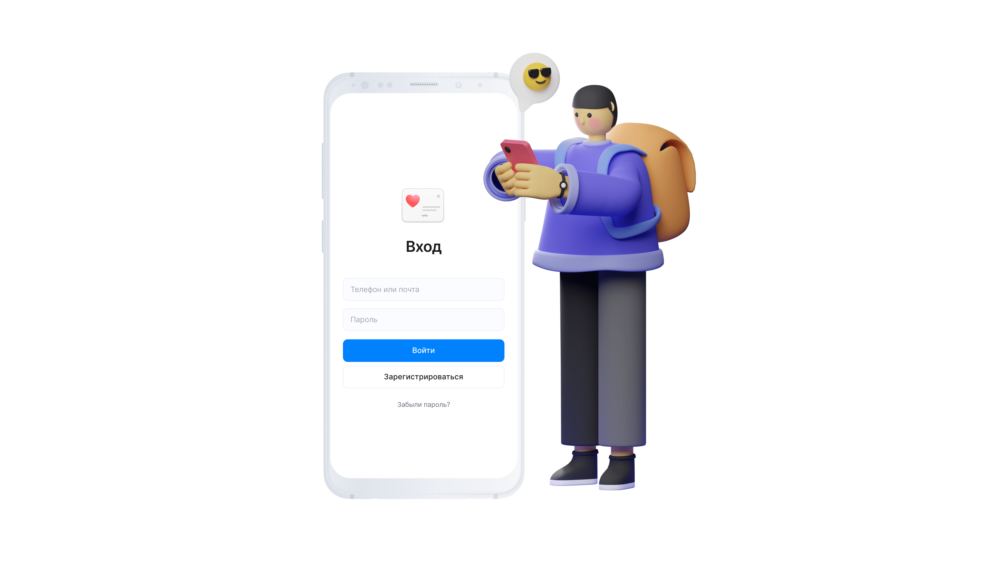

## О проекте

**Моё давление** — это сервис, в котором пациент автоматически делится с врачом замерами давления, а врач оперативно корректирует лечение.

### Ключевые особенности
- Вся информация, которая важна для пациента, представлена на одной странице в компактных виджетах, что позволяет пожилым людям легко ориентироваться. Чтобы внести замеры, достаточно нажать кнопку, ввести показатели и мгновенно увидеть их отображение на графике.
- Медицинская карточка пациента обеспечивает возможность для врача не только анализировать показатели, но и ознакомиться со всей историей болезни пациента, а также сохранять личные примечания, которые он считает важными. При этом личное присутствие на приёме у врача пациенту не требуется.

## Технологический стэк
- [Python 3.11](https://docs.python.org/3/) — интерпретируемый, объектно-ориентированный язык программирования высокого уровня с динамической семантикой.
- [Django Rest Framework](https://www.django-rest-framework.org/) — библиотека, которая работает со стандартными моделями Django для создания гибкого API.
- [Docker](https://www.docker.com/) — программное обеспечение для автоматизации развёртывания и управления приложениями в средах с поддержкой контейнеризации, контейнеризатор приложений.
- [Postgres](https://www.postgresql.org/) — мощная объектно-реляционная система баз данных с открытым исходным кодом.
- [Appcompat](https://developer.android.com/jetpack/androidx/releases/appcompat) — библиотека, позволяющая расширить возможности старых компонентов интерфейса на более свежих версиях Android API.
- [Material Library Android](https://m2.material.io/develop/android/docs/getting-started) — набор готовых компонентов для создания пользовательского интерфейса на Android в соответствии с принципами Material Design.
- [ConstraintLayout](https://developer.android.com/reference/androidx/constraintlayout/widget/ConstraintLayout) — позволяет создавать гибкие и масштабируемые визуальные интерфейсы.
- [Retrofit](https://square.github.io/retrofit/) — типобезопасный HTTP-клиент для Android и Java.
- [RxJava](https://github.com/ReactiveX/RxAndroid) — фреймворк от ReactiveX (RX) для реактивного программирования на Java.
- [Loggining-interseptor](https://square.github.io/okhttp/features/interceptors/) — мощный механизм, который может отслеживать, переписывать и повторять вызовы.
- [Legacy support](https://androidx.tech/artifacts/legacy/legacy-support-v4/1.0.0) — Статическая библиотека поддержки для Android с расширенными API и совместимостью от API 14.
- [MPAndroidChart](https://github.com/PhilJay/MPAndroidChart) — мощная и простая в использовании библиотека. диаграмм для Android.
- [OkHttp](https://square.github.io/okhttp/) — HTTP-клиент Android от Square
- [JUnit](https://developer.android.com/training/testing/local-tests) — фреймворк для языка Java, предназначенный для автоматического тестирования программ.



## Запуск сервера
```
docker-compose build
docker-compose up

or

docker-compose up --build
```